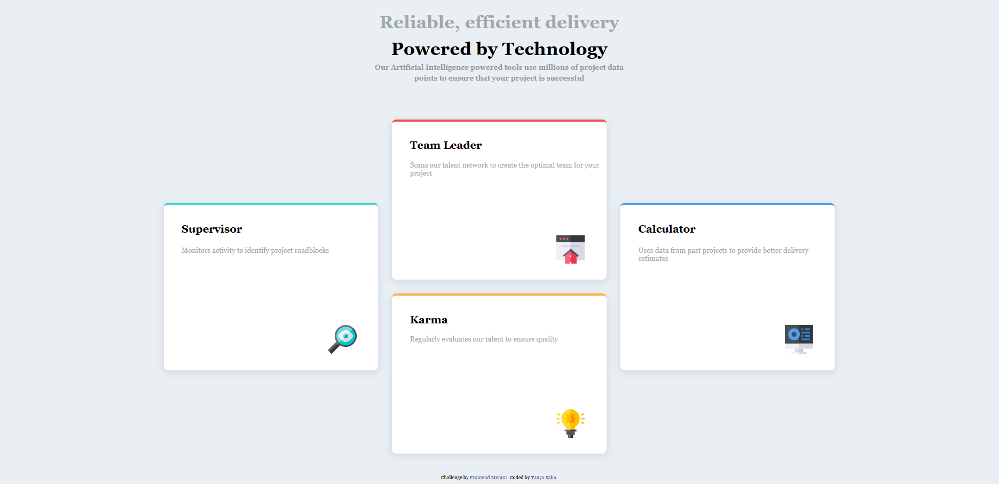

# Four Card Feature Section

A responsive landing page showcasing four feature cards with a modern, clean design. This project was built as part of a Frontend Mentor challenge.

## Overview

This project displays four feature cards in a unique grid layout that highlights different AI-powered tools. The design is fully responsive and adapts beautifully across mobile, tablet, and desktop devices.

### Features

- ✨ Responsive design for all screen sizes
- 🎨 Modern card layout with colored top borders
- 📱 Mobile-first approach
- 🖼️ Clean and minimal UI
- ♿ Semantic HTML structure

### Screenshot



## Built With

- HTML5
- CSS3
- CSS Grid
- Flexbox
- Responsive Design

## Layout

The page features four cards arranged in a distinctive pattern:
- **Supervisor** - Monitors activity to identify project roadblocks
- **Team Builder** - Scans talent network to create optimal teams
- **Karma** - Regularly evaluates talent to ensure quality
- **Calculator** - Uses past project data for better delivery estimates

## Responsive Breakpoints

- Mobile: up to 800px
- Tablet: 1025px - 1280px
- Desktop: 1281px and above

## Live Demo

[View Live Demo](#) <!-- Add your GitHub Pages link here -->

## Installation

1. Clone this repository
```bash
git clone https://github.com/yourusername/four-card-feature-section.git
```

2. Open `index.html` in your browser

## Author

**Tanya Sahu**

- GitHub: [@yourusername](https://github.com/yourusername)

## Acknowledgments

- Challenge by [Frontend Mentor](https://www.frontendmentor.io)
- Icons and design assets provided by Frontend Mentor

## License

This project is open source and available for personal and educational use.